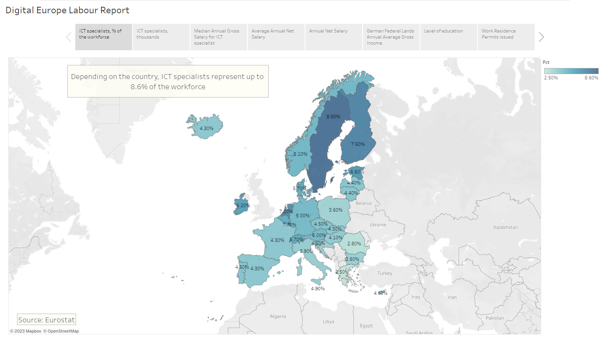
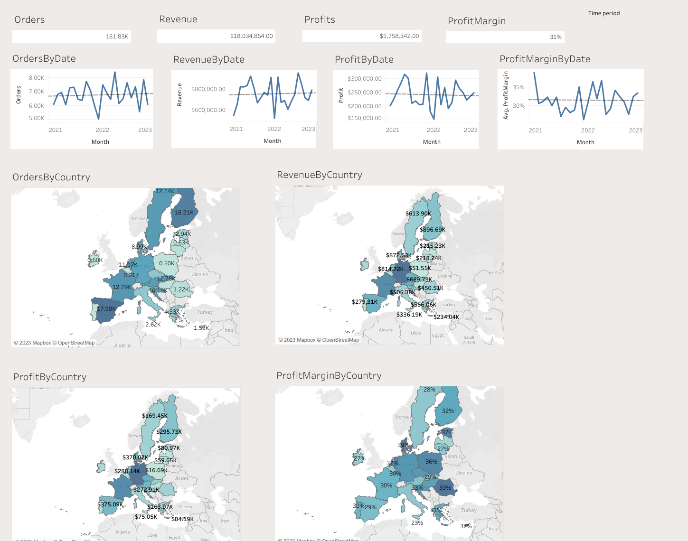
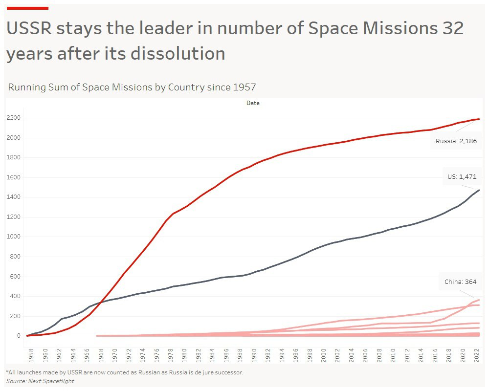
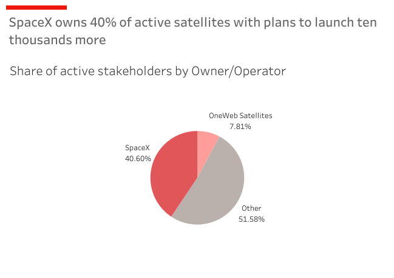

# DataAnalysis

Analytics projects outside working hours:

- Analysis of EU countries labor markets for foreign IT specialists: [here](digital-europe)

- Executive Dashboard for Online retail website: [here](online_retail)

- Space Missions Analysis : [here](space_missions)

- Active Satellites Analysis [here](satellites)

- Product Sales Data Analysis (Kaggle dataset): [here](product_sales/product-sales-data.ipynb)
- Prices Monitoring Analysis connected to data exported from my Scraper & Backend: [here](prices-monitoring-data.ipynb)

For ML-related scripts please refer to [the dedicated repo](https://github.com/SneakBug8/MLtests)
